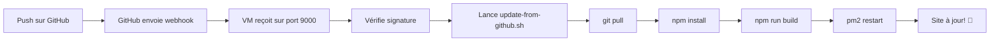

# 🚀 Déploiement Automatique avec GitHub Webhooks

Ce système permet de déployer automatiquement ton site sur la VM à chaque push sur la branche `main`.

## 🎯 Fonctionnement

```
GitHub Push → Webhook → VM reçoit notification → Script de mise à jour → Site déployé
```

## 📋 Installation sur la VM

### Étape 1 : Récupérer les fichiers

```bash
cd /opt/saas-agents-ia
git pull origin main
```

### Étape 2 : Lancer le script de configuration

```bash
chmod +x deployment/scripts/setup-webhook.sh
./deployment/scripts/setup-webhook.sh
```

Le script va :
- ✅ Générer un secret webhook sécurisé
- ✅ Créer et démarrer le service systemd
- ✅ Ouvrir le port 9000 dans le firewall
- ✅ Afficher les informations de configuration

**⚠️ IMPORTANT** : Note bien le **secret webhook** affiché, tu en auras besoin !

## 🔧 Configuration GitHub

### Étape 3 : Ajouter le webhook sur GitHub

1. Va sur : https://github.com/Nicolas69123/saas-agents-ia/settings/hooks
2. Clique sur **"Add webhook"**
3. Configure :

| Champ | Valeur |
|-------|--------|
| **Payload URL** | `http://86.202.190.207:9000/webhook` |
| **Content type** | `application/json` |
| **Secret** | Le secret généré par le script |
| **Which events?** | `Just the push event` |
| **Active** | ✅ Coché |

4. Clique sur **"Add webhook"**

### Étape 4 : Tester le webhook

Fais un petit changement et push sur `main` :

```bash
# Sur ton ordinateur local
cd /Users/nicolas/Dev/AI-ML/projects\ saas\ agents\ ia/
echo "# Test" >> README.md
git add README.md
git commit -m "test: webhook deployment"
git push origin main
```

Vérifie les logs sur la VM :

```bash
tail -f /var/log/webhook-deployment.log
```

Tu devrais voir :
```
[2025-12-02T...] 📨 Webhook reçu: push
[2025-12-02T...] ✅ Push détecté sur main par Nicolas
[2025-12-02T...] 🚀 Démarrage de la mise à jour...
[2025-12-02T...] ✅ Mise à jour terminée avec succès !
```

## 🛠️ Commandes Utiles

### Gérer le service

```bash
# Voir le statut
systemctl status webhook-deploy

# Redémarrer
systemctl restart webhook-deploy

# Arrêter
systemctl stop webhook-deploy

# Démarrer
systemctl start webhook-deploy

# Désactiver
systemctl disable webhook-deploy
```

### Voir les logs

```bash
# Logs en temps réel
tail -f /var/log/webhook-deployment.log

# Dernières 50 lignes
tail -50 /var/log/webhook-deployment.log

# Rechercher les erreurs
grep "❌" /var/log/webhook-deployment.log
```

### Tester manuellement

```bash
# Healthcheck
curl http://localhost:9000/health

# Simuler un webhook (dev)
curl -X POST http://localhost:9000/webhook \
  -H "Content-Type: application/json" \
  -H "X-GitHub-Event: push" \
  -d '{"ref":"refs/heads/main","pusher":{"name":"test"},"commits":[]}'
```

## 🔒 Sécurité

### Secret Webhook

Le secret webhook est stocké dans `/opt/saas-agents-ia/.env.webhook`

```bash
# Voir le secret actuel
cat /opt/saas-agents-ia/.env.webhook

# Changer le secret
nano /opt/saas-agents-ia/.env.webhook
systemctl restart webhook-deploy
# N'oublie pas de mettre à jour GitHub aussi !
```

### Firewall

Le port 9000 doit être ouvert :

```bash
# Vérifier
ufw status | grep 9000

# Ouvrir si nécessaire
ufw allow 9000/tcp comment "GitHub Webhook"
```

## 🐛 Troubleshooting

### Le webhook ne se déclenche pas

1. Vérifie que le service tourne :
```bash
systemctl status webhook-deploy
```

2. Vérifie les logs :
```bash
tail -50 /var/log/webhook-deployment.log
```

3. Teste le port :
```bash
curl http://localhost:9000/health
```

4. Vérifie GitHub :
   - Va sur https://github.com/Nicolas69123/saas-agents-ia/settings/hooks
   - Clique sur le webhook
   - Regarde l'onglet "Recent Deliveries"
   - Tu devrais voir des ✅ verts

### Erreur "Invalid signature"

Le secret GitHub ne correspond pas au secret sur la VM.

```bash
# Récupère le secret de la VM
cat /opt/saas-agents-ia/.env.webhook

# Mets à jour GitHub avec ce secret
```

### Le déploiement échoue

```bash
# Regarde les logs détaillés
tail -100 /var/log/webhook-deployment.log

# Teste le script manuellement
/opt/saas-agents-ia/deployment/scripts/update-from-github.sh
```

### Permission denied

```bash
# Rendre le script exécutable
chmod +x /opt/saas-agents-ia/deployment/webhook/webhook-receiver.js
chmod +x /opt/saas-agents-ia/deployment/scripts/update-from-github.sh

# Redémarrer le service
systemctl restart webhook-deploy
```

## 📊 Workflow Complet



## 🎉 C'est tout !

Maintenant, à chaque fois que tu push sur `main`, ton site se met à jour automatiquement sur la VM ! ✨

Plus besoin de SSH sur la VM pour déployer ! 🚀
