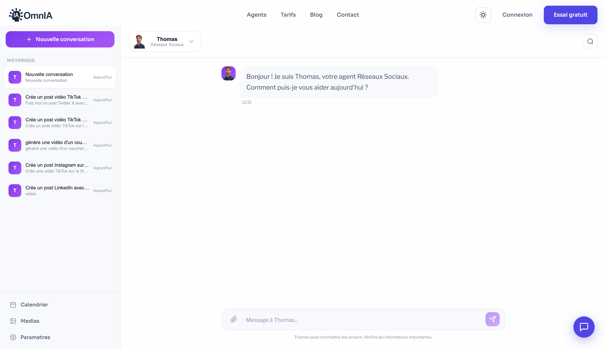
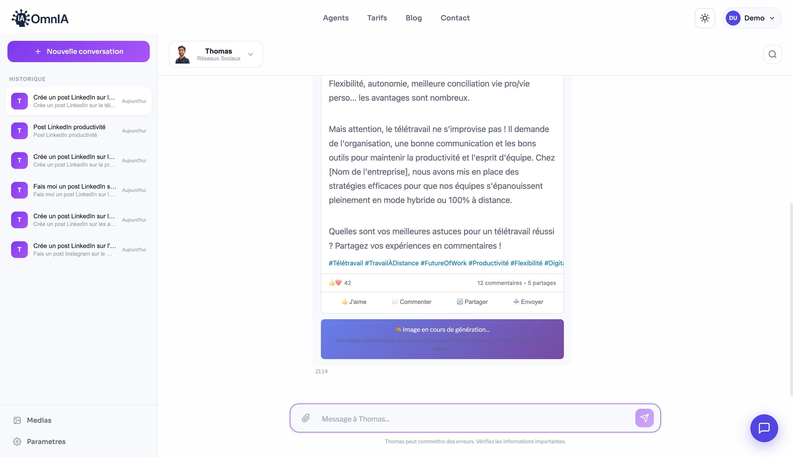

# Workflow Agent Marketing (Réseaux Sociaux)

> Documentation technique du workflow n8n pour l'Agent Marketing Thomas

## Vue d'ensemble

L'Agent Marketing "Thomas" est responsable de la génération automatique de contenus pour les réseaux sociaux. Il utilise l'IA Gemini pour créer des posts texte et des images adaptés à chaque plateforme.



---

## Architecture du Workflow

```
┌─────────────────┐     ┌─────────────────┐     ┌─────────────────┐
│   Chat Next.js  │────▶│  Webhook n8n    │────▶│   Gemini API    │
│   /chat?agent=4 │     │  /reseaux-sociaux│     │  (Texte + Image)│
└─────────────────┘     └─────────────────┘     └─────────────────┘
                                │
                                ▼
                        ┌─────────────────┐
                        │  Réponse JSON   │
                        │  (post + image) │
                        └─────────────────┘
```

---

## Composants du Workflow

### 1. Webhook Trigger

**URL** : `http://localhost:5678/webhook/reseaux-sociaux`

**Méthode** : POST

**Payload attendu** :
```json
{
  "message": "Crée un post LinkedIn sur l'IA",
  "agentId": 4,
  "conversationId": "uuid-conversation"
}
```

### 2. Nœud Code - Détection de Plateforme

Le workflow analyse automatiquement le message pour détecter :
- La plateforme cible (Twitter, LinkedIn, Instagram, Facebook, TikTok)
- Le type de contenu demandé (texte, image, vidéo)
- Le ton souhaité (professionnel, casual, humoristique)

```javascript
// Extrait du code de détection
const message = $input.first().json.message.toLowerCase();

let platform = 'twitter'; // Par défaut
if (message.includes('linkedin')) platform = 'linkedin';
if (message.includes('instagram')) platform = 'instagram';
if (message.includes('facebook')) platform = 'facebook';
if (message.includes('tiktok')) platform = 'tiktok';

let needsImage = message.includes('image') ||
                 message.includes('visuel') ||
                 message.includes('photo');
```

### 3. Nœud Gemini - Génération de Texte

**Modèle** : `gemini-2.0-flash-exp`

**Prompt système** :
```
Tu es Thomas, expert en réseaux sociaux pour OmnIA.
Génère un post {platform} sur le sujet demandé.

Règles :
- Twitter : max 280 caractères, hashtags pertinents
- LinkedIn : professionnel, 1500 caractères max
- Instagram : engageant, emojis, 30 hashtags max
- Facebook : conversationnel, appel à l'action
- TikTok : tendance, hooks accrocheurs
```

### 4. Nœud Gemini - Génération d'Image

**Modèle** : `gemini-2.0-flash-exp` (avec génération d'images)

**Prompt pour l'image** :
```
Génère une image professionnelle pour un post {platform}.
Sujet : {sujet extrait du message}
Style : moderne, épuré, adapté aux réseaux sociaux
Format : carré 1080x1080 pour Instagram, 16:9 pour autres
```

### 5. Réponse Webhook

**Format de réponse** :
```json
{
  "success": true,
  "response": "Voici votre post LinkedIn :\n\n🚀 L'IA transforme...",
  "post": {
    "platform": "linkedin",
    "content": "🚀 L'IA transforme notre façon de travailler...",
    "hashtags": ["#IA", "#Innovation", "#Tech"]
  },
  "image": {
    "generated": true,
    "url": "/media/generated-123456.png",
    "prompt": "Image professionnelle sur l'IA"
  }
}
```

---

## Intégration avec le Site

### API Route `/api/chat`

```typescript
// app/api/chat/route.ts
export async function POST(request: Request) {
  const { message, agentId } = await request.json();

  // Appel au webhook n8n
  const webhookUrl = getWebhookUrl(agentId);
  const response = await fetch(webhookUrl, {
    method: 'POST',
    headers: { 'Content-Type': 'application/json' },
    body: JSON.stringify({ message, agentId })
  });

  const data = await response.json();

  // Sauvegarde de l'image si générée
  if (data.image?.base64) {
    const imagePath = await saveGeneratedImage(data.image.base64);
    data.image.url = imagePath;
  }

  return NextResponse.json(data);
}
```

### Sauvegarde des Images

Les images générées sont sauvegardées dans `/public/media/` :

```typescript
async function saveGeneratedImage(base64: string): Promise<string> {
  const filename = `generated-${Date.now()}.png`;
  const buffer = Buffer.from(base64, 'base64');
  const path = `/public/media/${filename}`;

  await fs.writeFile(path, buffer);
  return `/media/${filename}`;
}
```

---

## Plateformes Supportées

| Plateforme | Caractères Max | Hashtags | Image | Vidéo |
|------------|----------------|----------|-------|-------|
| Twitter/X  | 280            | 5-10     | ✅    | ❌    |
| LinkedIn   | 3000           | 3-5      | ✅    | ❌    |
| Instagram  | 2200           | 30       | ✅    | ✅    |
| Facebook   | 63206          | 5-10     | ✅    | ✅    |
| TikTok     | 2200           | 5-10     | ❌    | ✅    |

---

## Mockups de Prévisualisation

Le site affiche des mockups réalistes pour chaque plateforme :



### Composants de Mockup

- `TwitterMockup.tsx` - Preview style Twitter/X
- `LinkedInMockup.tsx` - Preview style LinkedIn
- `InstagramMockup.tsx` - Preview style Instagram
- `FacebookMockup.tsx` - Preview style Facebook
- `TikTokMockup.tsx` - Preview style TikTok

---

## Publication Automatique

### Workflow de Publication

```
┌─────────────────┐     ┌─────────────────┐     ┌─────────────────┐
│   Calendrier    │────▶│  API /publish   │────▶│  Webhook n8n    │
│   Sélection     │     │                 │     │  /publish-post  │
└─────────────────┘     └─────────────────┘     └─────────────────┘
                                                        │
                                                        ▼
                                                ┌─────────────────┐
                                                │  Twitter API    │
                                                │  (Publication)  │
                                                └─────────────────┘
```

### API `/api/publish`

```typescript
export async function POST(request: Request) {
  const { platform, content, postId } = await request.json();

  const response = await fetch(N8N_PUBLISH_WEBHOOK, {
    method: 'POST',
    body: JSON.stringify({ platform, content })
  });

  // Mise à jour du statut du post
  await updatePostStatus(postId, 'published');

  return NextResponse.json({ success: true });
}
```

---

## Configuration n8n

### Variables d'Environnement

```env
N8N_URL=http://localhost:5678
N8N_API_KEY=your-api-key
GEMINI_API_KEY=your-gemini-key
TWITTER_API_KEY=your-twitter-key
TWITTER_API_SECRET=your-twitter-secret
TWITTER_ACCESS_TOKEN=your-access-token
TWITTER_ACCESS_SECRET=your-access-secret
```

### Import du Workflow

1. Ouvrir n8n : `http://localhost:5678`
2. Importer le fichier : `n8n-workflow-final.json`
3. Configurer les credentials Gemini
4. Activer le workflow

---

## Troubleshooting

### Erreur 403 Twitter
- Vérifier les credentials Twitter
- S'assurer que l'app a les permissions d'écriture
- Note : Les images ne peuvent pas être uploadées avec le tier gratuit

### Webhook non accessible
- Vérifier que n8n tourne : `http://localhost:5678`
- Vérifier l'URL du webhook dans `config/n8n-webhooks.ts`
- Tester avec curl : `curl -X POST http://localhost:5678/webhook/reseaux-sociaux`

### Image non générée
- Vérifier la clé API Gemini
- Vérifier les quotas de l'API
- Le modèle doit être `gemini-2.0-flash-exp` pour les images

---

## Fichiers Associés

- `config/n8n-webhooks.ts` - Configuration des webhooks
- `app/api/chat/route.ts` - API de chat
- `app/api/publish/route.ts` - API de publication
- `components/SocialMockups/` - Composants de prévisualisation
- `n8n-workflow-final.json` - Workflow n8n exporté
